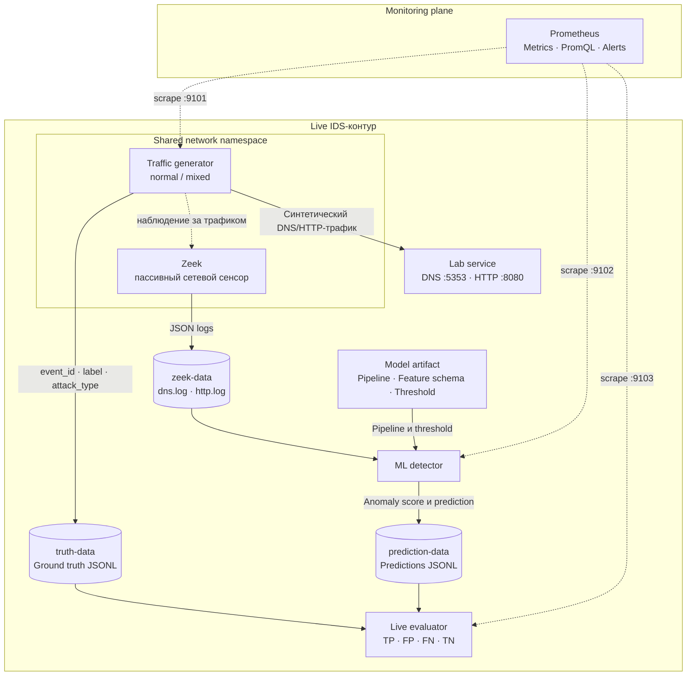

# IDS/IPS & ML lab

Воспроизводимый production-like учебный стенд для anomaly-based IDS: публичный подготовленный датасет, Isolation Forest, SHAP, long-running генератор трафика, live Zeek, detector, ground-truth evaluator и Prometheus. Grafana намеренно не включена: на практике достаточно Prometheus UI и PromQL.

> Стенд предназначен для обучения. Он обнаруживает события, но не блокирует пакеты и не должен подключаться к внешней сети как реальный IPS.

## Что уже лежит в репозитории

- `data/source/` — исходный публичный KDD Cup 1999 10% с проверяемой SHA-256 и описанием происхождения;
- `data/prepared/` — готовые `train.parquet`, `validation.parquet`, `test.parquet` и manifest;
- `notebooks/01_train_validate_explain.ipynb` — полный supervised demo: Logistic Regression и CatBoost;
- `notebooks/02_isolation_forest.ipynb` — полный anomaly demo: Isolation Forest, обучение только на normal;
- оба notebook используют весь локальный KDD source, feature engineering, корреляционный отбор, CV, bootstrap CI, метрики, SHAP и joblib;
- `models/ids_iforest_v1/` — готовый artifact: pipeline, threshold, schema, metadata, validation report;
- `src/ids_ml_lab/` — generator, online feature adapter, detector, evaluator и внутренние DNS/HTTP-сервисы;
- `zeek/` — live capture с JSON-логами;
- `prometheus/` — scrape-конфигурация и alert rules;
- `tests/` — unit-тесты feature contract, inference и live evaluation;
- `docker-compose.yml` — весь live-стенд без Grafana.

## Архитектура



`event_id` встраивается в DNS query или HTTP URI. Благодаря этому evaluator
сопоставляет prediction, сформированный по журналам Zeek, с ground truth без
приблизительного объединения по времени.


## Требования

- `uv` 0.12+;
- Python 3.12 (его установкой управляет `uv`);
- Docker Desktop / Docker Engine с Compose v2 — только для live-стенда;
- ориентировочно 3 GB свободного места для образов и окружения.

## Быстрый старт: ML-часть

```bash
uv sync --frozen --all-groups
uv run pytest
uv run python scripts/setup_notebook_kernel.py
source .venv/bin/activate
```

Готовые Parquet splits и model artifact уже включены. Чтобы проверить полную воспроизводимость с локального публичного source-файла:

```bash
uv run ids-build-data
uv run ids-train
uv run pytest
```

`ids-train` является каноническим путём изготовления модели и всегда создаёт согласованный полный artifact: pipeline, feature schema, threshold, metadata, validation report и SHAP importance. Два notebook экспортируют отдельные полные KDD-модели в `models/demo_logreg`, `models/demo_catboost`, `models/demo_iforest`; они не заменяют live artifact с 16 признаками.

Builder сначала проверяет SHA-256 источника, затем делает deterministic deduplication, balanced sample и stratified split 60/20/20 с seed `42`. Обучение использует только normal-строки training split. Validation labels нужны для выбора threshold, test используется один раз для финальной оценки.

## Быстрый старт: live-стенд

Готовый model artifact уже включён, поэтому достаточно:

```bash
docker compose up --build
```

Перед новой студенческой демонстрацией рекомендуется удалить runtime volumes предыдущего запуска:

```bash
docker compose down -v
docker compose up --build
```

Короткая автоматическая проверка запускается в отдельном Compose project и удаляет только созданные ею временные volumes:

```bash
make smoke
```

После старта доступны:

- Prometheus: <http://localhost:9090>
- generator metrics: <http://localhost:9101/metrics>
- detector metrics: <http://localhost:9102/metrics>
- evaluator metrics: <http://localhost:9103/metrics>

Полезные PromQL-запросы:

```promql
sum by (label, service, attack_type) (rate(ids_generator_events_total[2m]))
sum by (prediction, source) (rate(ids_detector_predictions_total[2m]))
ids_evaluator_precision
ids_evaluator_recall
ids_evaluator_f1
ids_evaluator_false_positive_rate
ids_evaluator_confusion_total
```

Сырые данные хранятся в named volumes (это устраняет проблемы UID/GID на Linux и macOS). Их удобно смотреть так:

```bash
docker compose exec generator tail -f /runtime/truth/events.jsonl
docker compose exec zeek tail -f /logs/dns.log /logs/http.log
docker compose exec detector tail -f /runtime/predictions/events.jsonl
```

Остановка:

```bash
docker compose down
```

Prometheus history и runtime-события хранятся в отдельных named volumes. Для полностью чистого нового эксперимента остановите стенд и удалите его volumes:

```bash
docker compose down -v
```

`make clean-runtime` очищает только локальный `runtime/`, если компоненты запускались напрямую через `uv`.

## Режимы генератора

По умолчанию используется `mixed`: нормальный фон плюс DNS-tunnel-like и HTTP-burst события с ground truth. Для одного нормального фона:

```bash
GENERATOR_MODE=normal docker compose up --build
```

Интенсивность, вероятности и targets задаются в `config/generator.yaml`. Значение `GENERATOR_MODE` имеет приоритет над файлом.

## Notebook и методика оценки

Оба notebook используют одинаковый Python из проектной `.venv`. Группы `analysis` и `dev`
включены по умолчанию для `uv run`, поэтому CLI не теряет notebook-зависимости.
После `uv sync --frozen --all-groups` выполните `uv run python scripts/setup_notebook_kernel.py`.
Откройте `.ipynb` прямо в **VS Code** (расширения Python и Jupyter).
В **Select Kernel → Python Environments** выберите проектный `.venv/bin/python`; первая ячейка проверяет prefix,
путь интерпретатора CLI и зарегистрированного kernel, Python 3.12 и версии пакетов.
Нажмите **Run All**. Если окружение не видно, используйте **Enter interpreter path** и укажите
абсолютный путь к `.venv/bin/python` этого проекта. Kernel хранится внутри `.venv`; после перемещения
проекта повторно зарегистрируйте его. Отдельный запуск JupyterLab не требуется.

Общая последовательность:

1. Проверка среды, загрузка всех локальных файлов данных и checksum.
2. Словарь 41 KDD-признака, примеры строк, качество данных и баланс классов.
3. Удаление повторных feature vectors и исключение векторов с противоречивым binary label.
4. Стратифицированный split 60/20/20 с seed 42, без balanced subsampling.
5. Stateless feature engineering: byte shares, объём/интенсивность, нулевой трафик, log1p.
6. Train-only удаление констант, дубликатов и Spearman-correlated признаков при |ρ| ≥ 0.90.
7. Supervised notebook: LR с scaling/OHE и CatBoost с native categories; anomaly notebook:
   Isolation Forest, включая preprocessing/selection, fit только на normal train.
8. 5-fold CV на train с повторным fit всего pipeline в каждом fold.
9. Максимум validation F1 при FPR ≤ 5%; test не участвует в выборе решений.
10. Итоговые ROC AUC, AP, Gini, accuracy, balanced accuracy, precision, recall, F1,
    specificity, FPR/FNR, MCC, KS, confusion matrix; log loss/Brier для supervised моделей.
11. 300 paired-bootstrap повторов для 95% CI при фиксированных модели и пороге.
12. Срезы по типам атак, протоколам/сервисам и примеры ошибок.
13. Global/local SHAP с проверкой аддитивности: log odds для LR/CatBoost, длина пути для леса.
14. Joblib bundle обученного pipeline и threshold, metadata, отчёт, CV/CI, SHAP, selection report;
    загрузка обратно и проверка одинаковых scores/predictions.

Полный запуск с чистых ядер и сохранением результатов в notebook:

```bash
uv run python scripts/execute_notebooks.py
```

При успешном запуске обновляются только два основных notebook. При ошибке диагностическая копия
сохраняется в скрытом каталоге `.notebook-diagnostics/`.
CLI inference из того же окружения:

```bash
uv run python scripts/predict_demo.py --model models/demo_logreg/model.joblib --split test
uv run python scripts/predict_demo.py --model models/demo_catboost/model.joblib --split test
uv run python scripts/predict_demo.py --model models/demo_iforest/model.joblib --split test
```

Demo bundles требуют 41 исходный KDD-признак. Их feature contract отличается от live Zeek:
для запуска стенда продолжайте использовать `ids-train` и `models/ids_iforest_v1`.
Bootstrap условен на обученную модель; случайный split KDD не является временной OOT-проверкой.

## Offline/online feature contract

Общие 16 признаков перечислены в `dataset_builder/schema.py`. Zeek adapter строит тот же schema из rolling двухсекундного окна, DNS и HTTP полей. Семантика live-полей является приближением к KDD-99 — это сделано явно, чтобы на следующих лекциях показать:

- training-serving skew;
- schema/version registry;
- data-quality checks и drift;
- shadow/canary rollout новой модели;
- feedback labels, retraining и model registry;
- безопасное превращение IDS-сигнала в IPS policy.

## Проверки и CI-команды

```bash
uv run ruff check .
uv run pytest --cov=ids_ml_lab --cov=dataset_builder
docker compose config --quiet
```

В `uv.lock` зафиксированы все Python-зависимости. Dockerfile фиксирует Python и `uv`; Compose фиксирует версии Zeek и Prometheus. Случайные процессы используют явный seed, входной dataset проверяется checksum, а manifest содержит checksum каждого prepared split.

## Ограничения

- KDD Cup 1999 исторический и синтетический; его метрики не переносятся на современную сеть.
- Docker capture использует network namespace генератора и видит только трафик учебного контейнера.
- Live feature adapter — демонстрационный, а не совместимый с конкретным production feature store.
- SHAP объясняет поведение модели, но не доказывает причинность и не является security verdict.

Происхождение и лицензия данных подробно описаны в `data/source/README.md`. Код репозитория распространяется по MIT, dataset — отдельно по CC BY 4.0.
